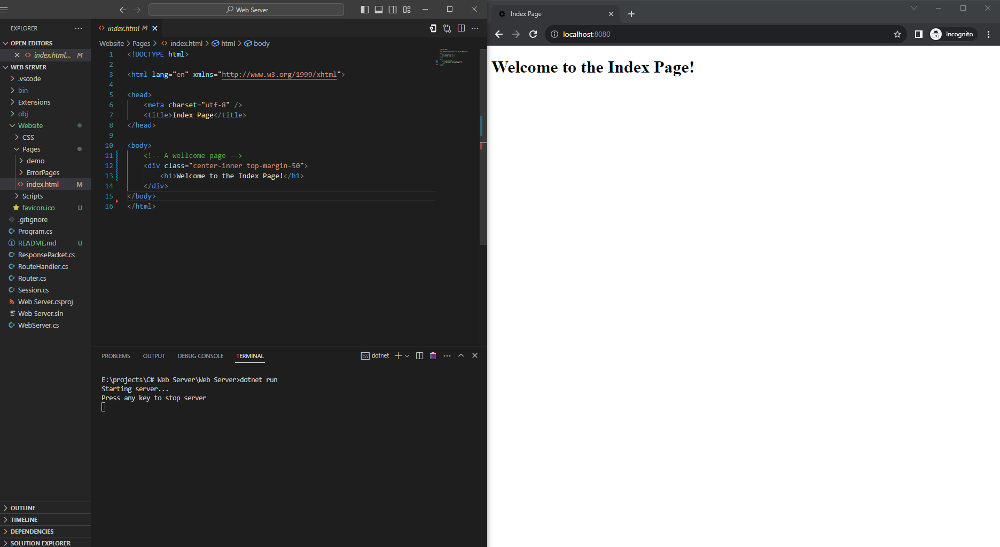

# Another Web Server in C#

This is a basic web server written in C#.

## Why?
- Better understanding of Web Servers
- Better understanding of C#
- Try something new

## Features
- Routing
- Static files
- Log requests to console
- Error handling
- Post requests
- Sessions
- AJAX
- CSRF protection

## How to use
- Clone the repository
- Open the solution in Visual Studio
- Run the project
- Open your browser and go to `http://localhost:8080`

## Screenshot

## Credits
- [Writing a Web Server from Scratch](https://www.codeproject.com/Articles/859108/Writing-a-Web-Server-from-Scratch)